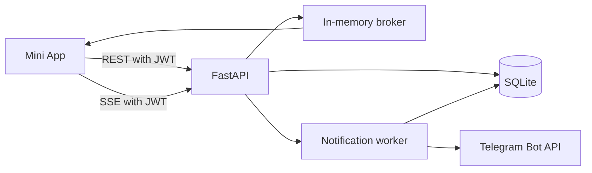
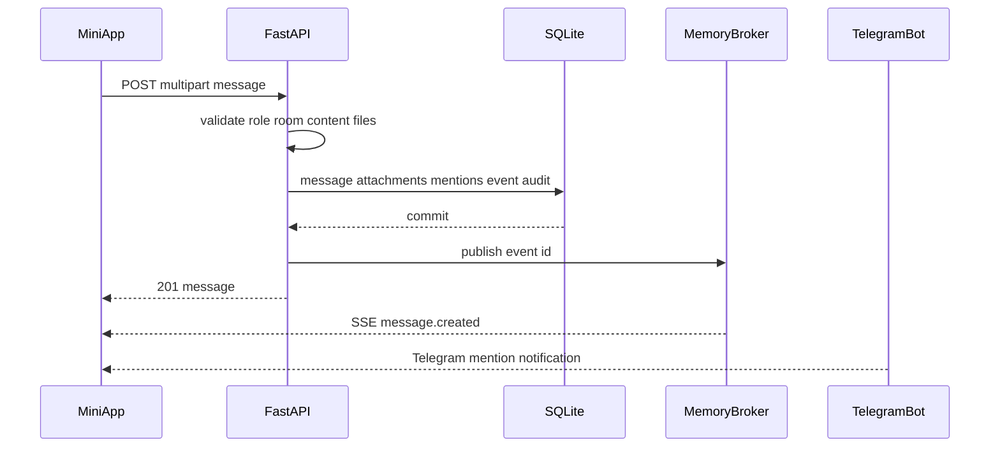

# Внутренний чат NOGA Systems: REST + SSE

Статус документа: техническая спецификация первой версии.

Этот документ описывает реализацию внутреннего чата для Mini App на текущем стеке:
FastAPI, async SQLAlchemy, SQLite, aiogram и статический frontend без сборки.

## 1. Границы первой версии

Чат доступен только внутренним ролям:

- `owner`;
- `right_hand`;
- `admin`.

Роль `noga` не участвует в чате. У неё нет chat-прав, точек входа в интерфейсе,
доступа к REST, SSE, вложениям, упоминаниям и уведомлениям.

Записи ног из справочника также не участвуют в модели чата. Чат работает только с
пользователями таблицы `users`.

В первую версию входят:

- две системные комнаты: «Общий» и «Команда»;
- приватные комнаты один-на-один между внутренними пользователями;
- текстовые сообщения;
- ответы на сообщения;
- структурированные упоминания;
- уведомления об упоминании в Mini App и через Telegram-бота;
- история с постраничной загрузкой;
- счётчики непрочитанных сообщений;
- один или несколько файлов суммарным размером до 100 МБ на сообщение;
- удаление собственных сообщений внутренними ролями;
- удаление любого сообщения ролью `owner`;
- почти мгновенная доставка событий через SSE;
- восстановление пропущенных событий после разрыва соединения.

В первую версию не входят:

- редактирование сообщений;
- групповые комнаты, создаваемые пользователями;
- реакции;
- поиск;
- закрепление сообщений;
- голосовые и видеозвонки;
- индикатор «печатает»;
- антивирусное сканирование файлов;
- Redis и горизонтальное масштабирование.

## 2. Комнаты и правила доступа

### 2.1. Системные комнаты

Миграция и idempotent bootstrap создают две комнаты:

| slug | Название | Доступ |
|---|---|---|
| `general` | Общий | owner, right_hand, admin |
| `team` | Команда | owner, right_hand, admin |

Обе комнаты имеют одинаковую матрицу доступа, но являются независимыми
тематическими лентами.

В первой версии системные комнаты нельзя переименовать, отключить или удалить через API.

### 2.2. Приватные комнаты

Приватная комната:

- содержит ровно двух пользователей;
- доступна только этим пользователям;
- уникальна для неупорядоченной пары пользователей;
- может быть создана любым активным `owner`, `right_hand` или `admin` с любым другим
  активным пользователем одной из этих ролей;
- возвращается существующей, если участники одновременно или повторно пытаются её создать.

Для пары `12` и `7` нормализованный ключ имеет значение `7:12`.

Если пользователь заблокирован, удалён или получает роль `noga`:

- новые REST-запросы от него отклоняются;
- его SSE-соединение закрывается после очередной проверки доступа;
- приватная история сохраняется для второго участника;
- начать с ним новый приватный чат нельзя;
- существующая комната не удаляется автоматически.

## 3. Права

В `backend/app/auth/permissions.py` добавляются:

| Право | owner | right_hand | admin | noga |
|---|:---:|:---:|:---:|:---:|
| `chat:read` | + | + | + | − |
| `chat:write` | + | + | + | − |
| `chat:direct` | + | + | + | − |
| `chat:delete_own` | + | + | + | − |
| `chat:delete_any` | + | − | − | − |

Право открывает действие в целом, а доступ к конкретной приватной комнате дополнительно
проверяется по `chat_room_members`.

Frontend скрывает недоступные элементы через `NogaRoles.can(...)`, но это не заменяет
серверную проверку.

## 4. Общая архитектура

REST является единственным способом изменять состояние. SSE только доставляет уже
зафиксированные события.



Отправка сообщения:



Основные свойства:

- SQLite остаётся источником истины;
- `chat_events` обеспечивает replay после reconnect;
- in-memory broker уменьшает задержку доставки;
- текущий production запускает ровно один uvicorn process;
- при нескольких process/replica broker необходимо заменить на Redis-совместимый.

## 5. Изменения в структуре проекта

Новые файлы:

- `backend/app/api/chat.py`;
- `backend/app/services/chat.py`;
- `backend/app/services/chat_broker.py`;
- `backend/app/services/chat_notifications.py`;
- `backend/alembic/versions/007_chat.py`;
- `backend/tests/test_chat.py`;
- `assets/js/screens/chat.js`;
- `_jsdom_chat.js`.

Изменяемые файлы:

- `backend/app/db/models.py`;
- `backend/app/schemas.py`;
- `backend/app/auth/permissions.py`;
- `backend/app/db/bootstrap.py`;
- `backend/app/services/users.py`;
- `backend/app/main.py`;
- `backend/app/config.py`;
- `backend/.env.example`;
- `assets/js/api.js`;
- `assets/js/views.js`;
- `assets/js/auth.js`;
- `assets/js/screens/dashboard.js`;
- `assets/js/screens/profile.js`;
- `assets/css/screens.css`;
- `index.html`;
- `README.md`;
- `DEPLOY.md`;
- `AGENTS.md`.

Дополнительная SSE-библиотека не обязательна. Достаточно
`fastapi.responses.StreamingResponse`.

## 6. Модель данных

Все enum объявляются с `native_enum=False`. Связи ORM используют `lazy="raise"`.

### 6.1. `chat_rooms`

| Поле | Тип | Ограничения |
|---|---|---|
| `id` | Integer | PK |
| `kind` | Enum `system`, `direct` | not null, index |
| `slug` | String(64) | nullable, unique |
| `title` | String(120) | nullable |
| `direct_key` | String(64) | nullable, unique |
| `is_active` | Boolean | not null, default true |
| `sort_order` | Integer | not null, default 0 |
| `created_at` | DateTime | server default |
| `updated_at` | DateTime | server default |

Инварианты сервиса:

- `system`: заполнены `slug` и `title`, `direct_key` пуст;
- `direct`: заполнен `direct_key`, `slug` и `title` пусты;
- direct title вычисляется по второму участнику;
- отключённая комната не принимает новые сообщения.

### 6.2. `chat_room_members`

| Поле | Тип | Ограничения |
|---|---|---|
| `id` | Integer | PK |
| `room_id` | Integer | FK `chat_rooms.id`, index |
| `user_id` | Integer | FK `users.id`, index |
| `joined_at` | DateTime | server default |

Ограничение: `UNIQUE(room_id, user_id)`.

Для системных комнат строки участников не создаются. Их доступ вычисляется по праву
`chat:read`. Для direct-комнаты сервис атомарно создаёт ровно две строки.

### 6.3. `chat_messages`

| Поле | Тип | Ограничения |
|---|---|---|
| `id` | Integer | PK |
| `room_id` | Integer | FK, not null, index |
| `author_id` | Integer | FK `users.id`, nullable, index |
| `author_name` | String(255) | not null, снимок имени |
| `body` | String(4000) | nullable |
| `content` | JSON | not null |
| `reply_to_id` | Integer | self FK, nullable, index |
| `deleted_at` | DateTime | nullable |
| `deleted_by_id` | Integer | FK `users.id`, nullable |
| `created_at` | DateTime | server default |

`content` хранит безопасные структурированные части:

```json
[
  {"type": "text", "text": "Проверьте документ, "},
  {"type": "mention", "user_id": 12, "label": "Иван Петров"},
  {"type": "text", "text": ", пожалуйста"}
]
```

Значение `label` формирует сервер из текущего `display_name` и сохраняет как снимок.
`body` — серверное plain-text представление для превью и Telegram-уведомлений. Клиент
не передаёт HTML.

После soft-delete:

- `body = NULL`;
- `content = []`;
- выставлены `deleted_at` и `deleted_by_id`;
- сообщение остаётся в ленте как «Сообщение удалено»;
- ответы продолжают ссылаться на эту строку;
- вложения удаляются;
- ожидающие Telegram-уведомления отменяются.

### 6.4. `chat_attachments`

| Поле | Тип | Ограничения |
|---|---|---|
| `id` | Integer | PK |
| `message_id` | Integer | FK, not null, index |
| `stored_path` | String(500) | not null, unique |
| `original_name` | String(255) | not null |
| `content_type` | String(120) | not null |
| `size_bytes` | BigInteger | not null |
| `uploaded_by_id` | Integer | FK `users.id`, nullable |
| `created_at` | DateTime | server default |

Файл хранится в:

```text
UPLOADS_DIR/chat/{room_id}/{message_id}/{uuid}
```

Расширение исходного имени не используется при построении пути.

### 6.5. `chat_mentions`

Таблица одновременно хранит in-app уведомление и persistent очередь Telegram-доставки.

| Поле | Тип | Ограничения |
|---|---|---|
| `id` | Integer | PK |
| `message_id` | Integer | FK, not null, index |
| `user_id` | Integer | FK `users.id`, nullable, index |
| `user_name` | String(255) | not null, снимок |
| `read_at` | DateTime | nullable, index |
| `telegram_status` | Enum | pending/sending/sent/retry/failed/cancelled |
| `telegram_attempts` | Integer | default 0 |
| `telegram_next_retry_at` | DateTime | nullable, index |
| `telegram_locked_at` | DateTime | nullable |
| `telegram_sent_at` | DateTime | nullable |
| `telegram_last_error` | String(500) | nullable |
| `created_at` | DateTime | server default |

Ограничение: `UNIQUE(message_id, user_id)`.

Текст сообщения, содержимое файлов и чувствительные данные в этой таблице не
дублируются.

### 6.6. `chat_reads`

| Поле | Тип | Ограничения |
|---|---|---|
| `id` | Integer | PK |
| `room_id` | Integer | FK, index |
| `user_id` | Integer | FK, index |
| `last_read_message_id` | Integer | FK, nullable |
| `updated_at` | DateTime | server default |

Ограничение: `UNIQUE(room_id, user_id)`.

Курсор может двигаться только вперёд. Переданный message обязан принадлежать комнате.

### 6.7. `chat_events`

| Поле | Тип | Ограничения |
|---|---|---|
| `id` | Integer | PK, autoincrement; для SQLite нужен именно `INTEGER PRIMARY KEY` |
| `room_id` | Integer | FK, nullable, index |
| `target_user_id` | Integer | FK, nullable, index |
| `type` | String(64) | not null, index |
| `payload` | JSON | not null |
| `created_at` | DateTime | server default, index |

Событие с `target_user_id = NULL` доступно всем пользователям с доступом к комнате.
Targeted-событие доступно только указанному пользователю.

Retention первой версии — 7 дней. Удаление старых событий выполняется периодической
задачей, но не затрагивает сообщения.

### 6.8. Индексы

Обязательные составные индексы:

- `chat_messages(room_id, id)`;
- `chat_room_members(user_id, room_id)`;
- `chat_reads(user_id, room_id)`;
- `chat_mentions(user_id, read_at)`;
- `chat_mentions(telegram_status, telegram_next_retry_at)`;
- `chat_events(room_id, id)`;
- `chat_events(target_user_id, id)`;
- `chat_events(created_at)`.

## 7. Миграция и bootstrap

`007_chat.py`:

1. создаёт enum и все таблицы;
2. создаёт индексы и unique constraints;
3. вставляет `general` и `team`;
4. не изменяет таблицы справочника ног;
5. downgrade удаляет таблицы в обратном порядке.

`bootstrap_chat_rooms(session)` в `backend/app/db/bootstrap.py` делает upsert по `slug`.
Это необходимо, потому что локальный запуск использует `Base.metadata.create_all`, а не
только Alembic.

Bootstrap вызывается после `bootstrap_owners`.

## 8. Поведение при изменении пользователя

`delete_user_account()` должен перед удалением пользователя:

- обнулить `chat_messages.author_id`;
- обнулить `chat_messages.deleted_by_id`;
- обнулить `chat_attachments.uploaded_by_id`;
- обнулить `chat_mentions.user_id`, отменив pending/retry уведомления;
- удалить `chat_reads`;
- удалить строки `chat_room_members`;
- удалить targeted `chat_events`, адресованные удаляемому пользователю. Обнулять
  `target_user_id` нельзя: это превратило бы персональное событие в room broadcast.

Снимки `author_name` и `user_name` сохраняют читаемость истории.

После удаления одного участника direct-комната остаётся доступной оставшемуся участнику
в режиме истории. Создание новых сообщений в ней запрещено, пока в комнате не два
активных участника с chat-правами.

Смена роли или блокировка не изменяет историю. Проверка выполняется на каждом REST-запросе
и периодически внутри SSE.

## 9. REST API

Все endpoints имеют prefix `/api/chat`.

### 9.1. Список комнат

```http
GET /api/chat/rooms
Authorization: Bearer <jwt>
```

Ответ:

```json
{
  "latest_event_id": 984,
  "total_unread": 4,
  "total_unread_mentions": 1,
  "rooms": [
    {
      "id": 1,
      "kind": "system",
      "slug": "general",
      "title": "Общий",
      "peer": null,
      "unread_count": 4,
      "unread_mentions": 1,
      "last_message": {
        "id": 145,
        "author_name": "Иван",
        "preview": "Проверьте документ",
        "has_attachments": false,
        "created_at": "2026-07-28T18:00:00Z"
      }
    }
  ]
}
```

Сортировка:

1. системные комнаты по `sort_order`;
2. direct-комнаты по дате последнего сообщения;
3. direct без сообщений — по `created_at`.

### 9.2. Допустимые собеседники

```http
GET /api/chat/peers
```

Возвращает активных owner/right_hand/admin, кроме текущего пользователя:

```json
[
  {
    "id": 12,
    "display_name": "Иван Петров",
    "username": "ivan",
    "role": "admin",
    "role_label": "Администратор",
    "room_id": 18
  }
]
```

`room_id` заполнен, если direct уже существует.

### 9.3. Создание приватной комнаты

```http
POST /api/chat/direct
Content-Type: application/json

{"peer_user_id": 12}
```

Успешные ответы:

- `201 Created` — создана новая комната;
- `200 OK` — существующая комната пары.

Создание выполняется атомарно:

1. проверить обоих пользователей;
2. вычислить `direct_key`;
3. найти существующую комнату;
4. при отсутствии вставить room и две member-строки;
5. записать audit;
6. commit;
7. при unique race перечитать комнату и вернуть её.

### 9.4. История комнаты

```http
GET /api/chat/rooms/{room_id}/messages?before_id=145&limit=50
```

- `limit`: 1–100, default 50;
- без `before_id` возвращается последняя страница;
- `around_id` вместо `before_id` возвращает контекст вокруг сообщения для deep link;
- `before_id` и `around_id` взаимоисключающие;
- SQL сортируется по `id DESC`, ответ разворачивается в `ASC`;
- удалённые сообщения присутствуют как заглушки.

Ответ сообщения:

```json
{
  "id": 145,
  "room_id": 1,
  "author": {
    "id": 7,
    "display_name": "Иван",
    "is_current_user": false
  },
  "content": [
    {"type": "text", "text": "Посмотрите, "},
    {"type": "mention", "user_id": 12, "label": "Пётр"}
  ],
  "reply": {
    "id": 140,
    "author_name": "Анна",
    "preview": "Предыдущее сообщение",
    "is_deleted": false
  },
  "attachments": [
    {
      "id": 33,
      "original_name": "document.pdf",
      "content_type": "application/pdf",
      "size_bytes": 102400
    }
  ],
  "is_deleted": false,
  "can_delete": false,
  "created_at": "2026-07-28T18:00:00Z"
}
```

`can_delete` вычисляет сервер.

### 9.5. Отправка сообщения

```http
POST /api/chat/rooms/{room_id}/messages
Content-Type: multipart/form-data
```

Поля:

- `content` — JSON-массив частей;
- `reply_to_id` — необязательный Integer;
- `files` — повторяемое поле UploadFile.

Пример `content`:

```json
[
  {"type": "text", "text": "Проверьте, "},
  {"type": "mention", "user_id": 12},
  {"type": "text", "text": ", пожалуйста"}
]
```

Правила:

- должно быть хотя бы непустое текстовое содержимое или файл;
- plain-text представление не длиннее 4000 символов;
- максимум 10 файлов;
- суммарный фактический размер файлов не больше 100 МБ;
- пустые text-части удаляются;
- соседние text-части объединяются;
- повторные упоминания одного пользователя дают одно уведомление;
- упомянуть можно только пользователя, имеющего доступ к комнате;
- в direct разрешены упоминания только двух участников;
- нельзя отвечать на сообщение из другой комнаты;
- нельзя отправлять в direct, если второй участник больше не активен или лишился chat-прав.

Порядок без длинной SQLite write-lock:

1. короткой сессией проверить пользователя, комнату, reply и mentions;
2. записать upload чанками во временный каталог, одновременно проверяя лимиты;
3. открыть новую короткую транзакцию и повторно проверить актуальный доступ;
4. создать message и выполнить `flush()` для id;
5. переместить временные файлы в конечный каталог и создать attachment metadata;
6. создать mention, event и audit;
7. commit;
8. опубликовать event id в broker;
9. вернуть `201`.

Если запись файла или commit падает, созданные файлы удаляются, транзакция откатывается,
SSE и Telegram не запускаются.

### 9.6. Удаление сообщения

```http
DELETE /api/chat/messages/{message_id}
```

Права:

- owner удаляет любое сообщение;
- right_hand/admin удаляют только собственное;
- повторное удаление возвращает `204`.

Удаление:

1. загружает message, room, attachments и mentions;
2. проверяет право и доступ к комнате;
3. очищает содержимое и помечает сообщение удалённым;
4. удаляет attachment metadata;
5. отменяет pending/retry mentions;
6. создаёт `message.deleted` и audit;
7. commit;
8. публикует SSE;
9. удаляет файлы с диска.

Ошибка физического удаления после commit логируется и не меняет HTTP-ответ.

### 9.7. Read cursor

```http
PATCH /api/chat/rooms/{room_id}/read
Content-Type: application/json

{"last_read_message_id": 145}
```

Курсор двигается только вперёд. Одновременно `read_at` выставляется непрочитанным
упоминаниям пользователя в этой комнате с `message_id <= last_read_message_id`.

Ответ:

```json
{
  "room_id": 1,
  "last_read_message_id": 145,
  "unread_count": 0,
  "unread_mentions": 0
}
```

Изменение создаёт targeted `read.updated` и audit без содержимого сообщений.

### 9.8. Уведомления об упоминаниях

```http
GET /api/chat/mentions?unread_only=true&limit=50
```

Ответ содержит room, message id, автора, время и короткое plain-text превью.

```http
PATCH /api/chat/mentions/{mention_id}/read
```

Чтение отдельного уведомления не обязательно двигает room cursor.

### 9.9. Скачивание вложения

```http
GET /api/chat/attachments/{attachment_id}
Authorization: Bearer <jwt>
```

Проверяется актуальный доступ пользователя к комнате сообщения.

Ответ:

- `Content-Type: application/octet-stream`;
- `Content-Disposition: attachment; filename*=UTF-8''...`;
- `X-Content-Type-Options: nosniff`;
- `Cache-Control: private, no-store`.

Прямой публичной ссылки на файл нет.

## 10. Ошибки API

Все бизнес-ошибки:

```json
{
  "detail": {
    "code": "CHAT_ROOM_FORBIDDEN",
    "message": "Нет доступа к этой комнате"
  }
}
```

Новые коды:

| HTTP | code | Смысл |
|---:|---|---|
| 400 | `CHAT_EMPTY_MESSAGE` | Нет текста и файлов |
| 400 | `CHAT_TEXT_TOO_LONG` | Больше 4000 символов |
| 400 | `CHAT_TOO_MANY_FILES` | Больше 10 файлов |
| 400 | `CHAT_FILES_TOO_LARGE` | Суммарно больше 100 МБ |
| 400 | `CHAT_BAD_CONTENT` | Некорректные части content |
| 400 | `CHAT_SELF_DIRECT` | Попытка создать чат с собой |
| 403 | `CHAT_FORBIDDEN` | Нет chat-права |
| 403 | `CHAT_ROOM_FORBIDDEN` | Нет доступа к комнате |
| 403 | `CHAT_PEER_FORBIDDEN` | Собеседник недоступен для чата |
| 403 | `CHAT_DELETE_FORBIDDEN` | Нельзя удалить сообщение |
| 404 | `CHAT_ROOM_NOT_FOUND` | Комната не найдена |
| 404 | `CHAT_MESSAGE_NOT_FOUND` | Сообщение не найдено |
| 404 | `CHAT_ATTACHMENT_NOT_FOUND` | Вложение не найдено |
| 409 | `CHAT_ROOM_INACTIVE` | Комната отключена |
| 409 | `CHAT_DIRECT_UNAVAILABLE` | Второй участник больше недоступен |
| 413 | `CHAT_FILES_TOO_LARGE` | Лимит выявлен при чтении тела |
| 429 | `CHAT_RATE_LIMITED` | Превышена частота запросов |

## 11. Audit

Audit actions:

- `chat.direct.created`;
- `chat.message.created`;
- `chat.message.deleted`;
- `chat.read.updated`;
- `chat.mention.read`.

В payload допускаются:

- room id и kind;
- message id;
- actor/peer id;
- число файлов;
- суммарный размер;
- число упоминаний;
- предыдущий и новый read cursor.

В audit запрещено писать:

- текст;
- structured content;
- имена файлов;
- Telegram preview;
- содержимое вложений.

## 12. SSE

### 12.1. Endpoint и авторизация

Основной stream:

```http
GET /api/chat/stream
Accept: text/event-stream
Authorization: Bearer <jwt>
Last-Event-ID: 984
```

Необязательный `room_id` ограничивает stream одной доступной комнатой:

```http
GET /api/chat/stream?room_id=1
```

Frontend использует `fetch` + `ReadableStream`. Нативный `EventSource` не используется,
потому что он не умеет отправлять `Authorization`.

JWT запрещено передавать в query string.

### 12.2. Заголовки ответа

```text
Content-Type: text/event-stream; charset=utf-8
Cache-Control: no-cache, no-transform
Connection: keep-alive
X-Accel-Buffering: no
```

### 12.3. Формат события

```text
id: 985
event: message.created
data: {"event_id":985,"type":"message.created","room_id":1,"data":{"message":{}},"created_at":"2026-07-28T18:00:00Z"}

```

Каждый frame завершается двумя переводами строки. JSON сериализуется без сырых переводов
строк внутри `data`.

Envelope:

```json
{
  "event_id": 985,
  "type": "message.created",
  "room_id": 1,
  "data": {},
  "created_at": "2026-07-28T18:00:00Z"
}
```

Типы:

- `message.created` — broadcast в комнату;
- `message.deleted` — broadcast в комнату;
- `mention.created` — targeted упомянутому;
- `read.updated` — targeted владельцу read cursor;
- `stream.reset` — replay невозможен, нужен REST reload;
- `access.revoked` — текущий пользователь потерял chat-доступ.

### 12.4. Heartbeat

Каждые 15 секунд сервер отправляет комментарий:

```text
: heartbeat 2026-07-28T18:00:00Z

```

Heartbeat:

- не создаётся в `chat_events`;
- не меняет `Last-Event-ID`;
- не передаётся обработчику бизнес-событий;
- не открывает DB-транзакцию на всё время stream.

### 12.5. Broker

`ChatBroker` хранит подписчиков только в памяти:

- одна bounded `asyncio.Queue` на stream;
- default queue size — 100;
- subscribe/unsubscribe защищены `asyncio.Lock`;
- publish использует `put_nowait`;
- мёртвые подписчики удаляются в `finally`.

При переполнении queue stream получает sentinel и закрывается. Клиент переподключается,
а пропущенные события восстанавливаются из `chat_events`.

### 12.6. Replay без окна потери

Порядок подключения:

1. проверить JWT и chat-права;
2. вычислить доступные room ids;
3. подписать queue на broker;
4. короткой отдельной DB-сессией выбрать events `id > Last-Event-ID`;
5. отправить replay по id;
6. читать live queue;
7. дедуплицировать события с `id <= last_sent_id`;
8. каждые 15 секунд выполнять DB catch-up;
9. каждые 60 секунд перечитывать User и доступ.

Подписка до SELECT закрывает окно между replay и live publish. Дедупликация убирает
событие, попавшее одновременно в DB replay и queue.

Событие доступно stream, если:

- `target_user_id` равен текущему user id; либо
- `target_user_id` пуст и пользователь имеет доступ к `room_id`.

### 12.7. Retention gap

Если `Last-Event-ID` старше самого раннего доступного события:

1. сервер отправляет `stream.reset` с текущим максимальным event id;
2. закрывает stream;
3. клиент повторно загружает rooms и открытую историю через REST;
4. клиент переподключается с cursor из `stream.reset`.

### 12.8. Reconnect клиента

Задержки: 1, 2, 5, 10 и 30 секунд, затем 30 секунд с jitter ±20%.

Reconnect выполняется:

- при EOF;
- при сетевой ошибке;
- после возвращения `navigator.onLine`;
- при переходе документа в `visible`;
- после queue overflow;
- после рестарта backend.

Поведение статусов:

- `401` — вызвать общий unauthorized handler и остановиться;
- `403` — перечитать текущего пользователя, скрыть чат и остановиться;
- `429/5xx` — reconnect с backoff;
- `AbortError` от намеренного `AbortController.abort()` — не reconnect.

## 13. Backend lifecycle

В `app.main.lifespan`:

1. создать uploads directory;
2. создать таблицы;
3. bootstrap owners;
4. bootstrap системные chat rooms;
5. создать `app.state.chat_broker`;
6. создать bot, если включены polling или chat notifications;
7. запустить bot polling при `BOT_POLLING_ENABLED`;
8. запустить notification worker;
9. запустить event cleanup worker;
10. при shutdown отменить задачи, очистить subscribers и закрыть bot/session.

SSE generator не должен использовать `Depends(get_session)` как долгоживущую сессию.
Он получает user id после первичной проверки, а далее открывает короткие
`SessionLocal()` только для replay, catch-up и revalidation.

## 14. Telegram-уведомления

Уведомление создаётся только для структурированного mention.

Не отправлять уведомление:

- автору сообщения;
- заблокированному пользователю;
- пользователю без актуального доступа к комнате;
- по удалённому сообщению;
- повторно для той же mention-строки.

Текст:

```text
Иван Петров упомянул вас в чате «Команда»
```

Текст сообщения и имена файлов в Telegram не отправляются.

К уведомлению добавляется WebApp-кнопка «Открыть чат». URL строится из `WEBAPP_URL` с
параметрами `chat_room` и `chat_message`. После авторизации frontend открывает комнату,
загружает нужную страницу и подсвечивает сообщение.

### 14.1. Persistent delivery

HTTP-ответ отправки сообщения не ждёт Telegram API. Сохранённая `chat_mentions` является
очередью.

Worker:

1. раз в 2 секунды выбирает due `pending/retry`;
2. переводит ограниченную пачку в `sending`, ставит `locked_at`, commit;
3. отправляет сообщения вне DB-транзакции;
4. записывает `sent`, `retry` или `failed`;
5. восстанавливает зависшие `sending`, если lock старше 5 минут.

Retry:

- максимум 8 попыток;
- 5 секунд, 30 секунд, 2 минуты, 10 минут, 30 минут, 2 часа, 6 часов;
- Telegram `retry_after` имеет приоритет;
- сетевые и 5xx ошибки повторяются;
- запрет отправки пользователю и неизвестный chat id — terminal `failed`;
- ошибка Telegram не откатывает сообщение.

Bot создаётся, если включён polling или Telegram-уведомления. Polling и исходящие
уведомления используют один экземпляр `Bot`.

## 15. Файлы и безопасность

### 15.1. Ограничения

- максимум 10 файлов в сообщении;
- максимум 100 МБ фактического суммарного размера;
- тип файла произвольный;
- лимит проверяется и на клиенте, и на сервере;
- доверять `Content-Length`, расширению и browser MIME нельзя.

Сервер читает `UploadFile` чанками по 1 МБ, как загрузки файлов ног. После каждого чанка
увеличивается общий счётчик сообщения. При превышении лимита чтение прекращается,
частичные файлы удаляются, возвращается 413.

### 15.2. Хранение

- корень берётся из существующего `UPLOADS_DIR`;
- имя на диске — UUID без пользовательского пути;
- `../`, абсолютные пути и исходное имя никогда не участвуют в filesystem path;
- исходное имя хранится только как metadata;
- каталоги создаются с безопасными правами пользователя сервиса;
- файлы не раздаются nginx напрямую.

### 15.3. Выдача

Даже изображения и PDF отдаются как download:

- `application/octet-stream`;
- `Content-Disposition: attachment`;
- `nosniff`;
- обязательный JWT;
- повторная проверка room access;
- без публичных URL и долгого cache.

Frontend может показать только локальное безопасное превью выбранного файла. Автоматически
рендерить загруженный SVG/HTML/PDF внутри страницы нельзя.

### 15.4. Остаточный риск

Первая версия не сканирует файлы на вредоносное содержимое. Поэтому:

- файлы никогда не исполняются на сервере;
- браузеру не предлагается inline-render;
- UI предупреждает пользователя перед скачиванием неизвестного типа;
- в следующей версии рекомендуется ClamAV или внешний scanner;
- нужен мониторинг свободного диска и резервное копирование `data/uploads`.

## 16. Rate limiting

Для текущего single-process допускается in-memory token bucket:

- 30 сообщений в минуту на пользователя;
- 5 сообщений с файлами за 10 минут;
- 20 попыток создания direct в минуту;
- максимум 3 одновременных SSE stream на пользователя.

Rate limiter очищает неактивные ключи. После перехода на несколько process он должен быть
перенесён в Redis вместе с broker.

## 17. Frontend

Frontend остаётся статическим и ES5-совместимым, кроме существующего использования
`async/await`.

### 17.1. View

В `index.html` добавляются:

- `viewChatRooms`;
- `viewChatRoom`.

В `assets/js/views.js` оба id добавляются в `VIEW_IDS`.

`assets/js/screens/chat.js` экспортирует:

```javascript
window.NogaChat = {
  show: show,
  openRoom: openRoom,
  openMessage: openMessage,
  applyEvent: applyEvent,
  applyUnread: applyUnread,
  release: release
};
```

### 17.2. Точки входа

- колокольчик `#bell` открывает список комнат;
- профиль содержит пункт «Чат» при `chat:read`;
- таббар не меняется;
- роль без `chat:read` не видит колокольчик как активную кнопку и не запускает SSE.

Пункт чата в `profile.js` добавляется до role-specific sections, но только по permission.

Текущий toggle-заглушка колокольчика в `dashboard.js` удаляется.

### 17.3. Список комнат

Список объединяет:

- две системные комнаты сверху;
- direct-комнаты ниже по активности.

Карточка показывает:

- название;
- автора и preview последнего сообщения;
- время;
- unread count;
- отдельный mention marker.

Кнопка «Новый чат» вызывает `GET /api/chat/peers`. Выбор пользователя вызывает
idempotent `POST /api/chat/direct`, затем открывает комнату.

### 17.4. Лента

- первая загрузка — последние 50 сообщений;
- подгрузка вверх по `before_id`;
- при prepend сохраняется визуальная позиция scroll;
- сообщения дедуплицируются по id;
- событие открытой комнаты добавляется без полной перерисовки;
- автоскролл выполняется, только если пользователь находился у нижней границы;
- иначе показывается кнопка «Новые сообщения»;
- read cursor двигается только при видимой комнате и достижении нижней границы;
- DOM-значения вставляются через `textContent`.

### 17.5. Composer

Composer содержит:

- textarea;
- кнопку выбора файлов;
- список выбранных файлов и суммарный размер;
- reply bar;
- mention picker;
- кнопку отправки;
- upload progress.

Reply bar показывает автора и короткий preview. Клик по reply preview в сообщении
прокручивает к исходному сообщению либо догружает нужную страницу.

Mention picker получает пользователей через chat endpoint, а не `GET /api/users`, потому
что `users:read` и `chat:read` — разные права.

Выбранное упоминание хранится как отдельная content-part, а не как распознанная строка
`@name`.

### 17.6. Upload progress

Для multipart до 100 МБ `sendChatMessage` реализуется через `XMLHttpRequest`, обёрнутый
в Promise:

- вручную добавляется Bearer header;
- `xhr.upload.onprogress` обновляет процент;
- `Content-Type` не устанавливается вручную;
- 401 передаётся общему unauthorized handler;
- отмена доступна через `xhr.abort()`.

### 17.7. SSE parser

`NogaApi.openChatStream()`:

- делает fetch с Bearer и `Last-Event-ID`;
- использует `TextDecoder(..., {stream:true})`;
- сохраняет неполный chunk в buffer;
- разбирает строки `id`, `event`, `data`;
- объединяет несколько `data` строк;
- игнорирует comment heartbeat;
- dispatch выполняет только после пустой строки;
- возвращает handle с `abort()`;
- реализует backoff и не reconnect после намеренного abort.

Последний event id хранится только в памяти. `GET /api/chat/rooms` возвращает рядом со
списком максимальный `latest_event_id`, видимый этому пользователю. После полной
перезагрузки rooms/history становятся начальной синхронизацией, а stream стартует с этого
cursor.

### 17.8. Unread и mentions

Три уровня:

- общий badge колокольчика;
- badge комнаты;
- подсветка упоминания в ленте.

Targeted SSE обновляет badge без перезагрузки всех экранов. REST остаётся источником
истины после reconnect.

### 17.9. Освобождение ресурсов

`NogaChat.release()`:

- abort SSE при завершении сессии;
- abort активной загрузки;
- отзывает все `URL.createObjectURL`;
- удаляет listeners, созданные на время комнаты;
- очищает большие массивы истории.

SSE может оставаться глобальным при обычном переходе между view. Он закрывается при
unauthorized, потере chat-права или уничтожении сессии.

## 18. Настройки

Новые settings и значения по умолчанию:

```dotenv
CHAT_ENABLED=true
CHAT_MESSAGE_MAX_CHARS=4000
CHAT_FILES_MAX_COUNT=10
CHAT_UPLOAD_MAX_TOTAL_MB=100
CHAT_SSE_HEARTBEAT_SECONDS=15
CHAT_SSE_REVALIDATE_SECONDS=60
CHAT_SSE_QUEUE_SIZE=100
CHAT_EVENT_RETENTION_DAYS=7
CHAT_TELEGRAM_NOTIFICATIONS_ENABLED=true
CHAT_NOTIFY_POLL_SECONDS=2
CHAT_NOTIFY_MAX_ATTEMPTS=8
CHAT_RATE_MESSAGES_PER_MINUTE=30
CHAT_RATE_UPLOADS_PER_10_MINUTES=5
```

`CHAT_ENABLED=false`:

- REST и stream возвращают 404;
- workers не запускаются;
- `MeOut` и user внутри auth-ответа содержат `features.chat = false`;
- frontend требует одновременно `features.chat` и `chat:read`, поэтому не показывает
  неработающую точку входа даже при наличии статического permission.

Лимиты валидируются в `Settings`: положительные значения и разумные верхние границы.

## 19. Reverse proxy

В репозитории нет готового nginx-конфига, поэтому `DEPLOY.md` должен содержать пример:

```nginx
server {
    listen 443 ssl http2;
    server_name noga-api.duckdns.org;

    client_max_body_size 110m;

    location /api/chat/stream {
        proxy_pass http://127.0.0.1:8000;
        proxy_http_version 1.1;

        proxy_set_header Host $host;
        proxy_set_header X-Real-IP $remote_addr;
        proxy_set_header X-Forwarded-For $proxy_add_x_forwarded_for;
        proxy_set_header X-Forwarded-Proto $scheme;
        proxy_set_header Authorization $http_authorization;
        proxy_set_header Connection "";

        proxy_buffering off;
        proxy_cache off;
        proxy_read_timeout 3600s;
        proxy_send_timeout 3600s;
        gzip off;

        add_header X-Accel-Buffering no always;
        add_header Cache-Control "no-cache, no-transform" always;
    }

    location /api/chat/ {
        proxy_pass http://127.0.0.1:8000;
        proxy_http_version 1.1;

        proxy_set_header Host $host;
        proxy_set_header X-Real-IP $remote_addr;
        proxy_set_header X-Forwarded-For $proxy_add_x_forwarded_for;
        proxy_set_header X-Forwarded-Proto $scheme;
        proxy_set_header Authorization $http_authorization;

        proxy_request_buffering off;
        proxy_read_timeout 600s;
        proxy_send_timeout 600s;
    }

    location / {
        proxy_pass http://127.0.0.1:8000;
    }
}
```

`110m` оставляет запас на multipart overhead, но приложение всё равно разрешает только
100 МБ фактического содержимого файлов.

После изменения:

```bash
sudo nginx -t
sudo systemctl reload nginx
```

## 20. Ограничение одного process

Текущие команды уже запускают один process:

```text
uvicorn app.main:app --host 0.0.0.0 --port 8000
```

Нельзя добавлять `--workers 2` или несколько API replicas, пока broker и rate limiter
находятся в памяти.

При масштабировании нужны:

- Redis Pub/Sub или Streams;
- Redis rate limiter;
- distributed notification claim;
- общая файловая система либо object storage;
- PostgreSQL вместо SQLite для высокой конкуренции записей.

## 21. SQLite

Правила:

- не держать DB-сессию на протяжении SSE;
- не держать транзакцию во время Telegram API;
- файл читать до commit, но вне длительной write-транзакции насколько возможно;
- все SELECT выполнять до ORM-мутаций, чтобы autoflush не дал неожиданный 500;
- использовать короткие commits;
- сериализовать только необходимые relationship через `selectinload`;
- после commit перечитывать данные с `populate_existing=True`;
- включить SQLite busy timeout;
- контролировать рост `chat_events`, `audit_log` и файлов.

При ожидаемой интенсивной переписке миграция на PostgreSQL должна предшествовать
горизонтальному масштабированию.

## 22. Наблюдаемость

Структурированные log events:

- `chat.message.created`;
- `chat.message.deleted`;
- `chat.sse.connected`;
- `chat.sse.disconnected`;
- `chat.sse.queue_overflow`;
- `chat.sse.replay`;
- `chat.sse.reset`;
- `chat.upload.rejected`;
- `chat.telegram.sent`;
- `chat.telegram.retry`;
- `chat.telegram.failed`;
- `chat.cleanup.completed`.

Не логировать body, content, оригинальные имена файлов и Telegram preview.

Минимальные counters:

- активные SSE connections;
- число событий в broker;
- queue overflow;
- средняя replay batch;
- сообщения в минуту;
- upload bytes;
- pending/retry/failed Telegram mentions;
- размер `chat_events`;
- свободное место на диске.

`GET /api/health` остаётся дешёвым. При необходимости добавить отдельный внутренний
diagnostic endpoint, доступный только owner, но не проверять Telegram API на каждом health.

## 23. Тесты backend

`backend/tests/test_chat.py` остаётся standalone script по стилю проекта.

### 23.1. Матрица ролей

- owner/right_hand/admin видят обе системные комнаты;
- роль `noga` получает 403 на rooms, peers, history, send, read, delete, attachment и stream;
- blocked пользователь немедленно теряет REST;
- смена внутренней роли на `noga` закрывает доступ при revalidation.

### 23.2. Direct

- каждая пара создаётся один раз независимо от порядка id;
- повторный POST возвращает ту же комнату;
- конкурентная вставка не создаёт дубль;
- self direct отклоняется;
- peer с ролью `noga` или status blocked отклоняется;
- третий пользователь не видит room, messages, SSE и attachments;
- после удаления участника история остаётся второму только для чтения.

### 23.3. Сообщения

- текст, файл-only и text+files;
- пустое сообщение;
- 4000 и 4001 символ;
- reply из той же и другой комнаты;
- корректная сериализация deleted reply;
- structured mention и дедупликация;
- mention недоступного пользователя;
- сортировка и `before_id`;
- серверный `can_delete`.

### 23.4. Удаление

- автор admin/right_hand удаляет своё;
- неавтор admin/right_hand получает 403;
- owner удаляет любое;
- повторное удаление idempotent;
- содержимое очищено;
- attachment metadata удалено;
- pending notification cancelled;
- файл удаляется после commit.

### 23.5. Файлы

- 10 файлов разрешены, 11 отклоняются;
- общий лимит проверяется по фактически прочитанным bytes;
- тест использует подменяемую малую константу, а не создаёт 100 МБ fixture;
- частичные файлы очищаются при превышении и rollback;
- path traversal в имени не влияет на stored path;
- download требует room access;
- response содержит attachment и nosniff.

### 23.6. Read и mentions

- cursor только вперёд;
- чужой message id отклоняется;
- unread count не включает собственные сообщения;
- room read закрывает mentions до cursor;
- targeted events не попадают другому пользователю.

### 23.7. SSE

- live delivery после commit;
- событие отсутствует после rollback;
- replay по Last-Event-ID;
- порядок event id;
- дедупликация replay/queue;
- heartbeat;
- queue overflow приводит к reconnect path;
- retention gap даёт `stream.reset`;
- disconnect очищает subscriber;
- generator не удерживает одну AsyncSession;
- revalidation закрывает stream при block/role change.

### 23.8. Telegram

Bot полностью mock:

- успешная отправка;
- retry после network/5xx;
- Telegram retry_after;
- terminal failure;
- восстановление stale sending lock;
- удалённое сообщение не отправляется;
- ошибка не откатывает message.

### 23.9. Удаление пользователя

- FK очищены;
- author snapshot остаётся;
- read/member rows удалены;
- уведомления отменены;
- ранее выданный JWT перестаёт работать.

## 24. Frontend jsdom

`_jsdom_chat.js`:

1. загружает scripts в порядке `index.html`;
2. добавляет polyfills `matchMedia`, `scrollIntoView`, object URL и ReadableStream;
3. подменяет fetch и XHR;
4. проверяет:
   - скрытие чата без permission;
   - системные и direct cards;
   - idempotent открытие direct;
   - пагинацию вверх;
   - SSE frame, разбитый между chunks;
   - несколько frames в chunk;
   - reconnect и Last-Event-ID;
   - unread badge;
   - reply bar;
   - structured mention;
   - client reject больше 100 МБ;
   - upload progress;
   - отсутствие вставки сырого HTML;
   - revoke object URLs;
   - abort при unauthorized.

## 25. Ручная проверка

REST:

```bash
curl -H "Authorization: Bearer $TOKEN" \
  https://noga-api.duckdns.org/api/chat/rooms
```

SSE:

```bash
curl -N \
  -H "Accept: text/event-stream" \
  -H "Authorization: Bearer $TOKEN" \
  https://noga-api.duckdns.org/api/chat/stream
```

Проверить:

- первый heartbeat приходит не позднее 15 секунд;
- сообщение появляется без ручного refresh;
- рестарт API вызывает reconnect;
- события между disconnect/reconnect восстанавливаются;
- 100 МБ проходит, превышение отклоняется;
- пользователь без chat-прав не получает данные;
- Telegram-кнопка открывает нужную комнату.

## 26. Rollout

1. Проверить свободное место под backup и uploads.
2. Сделать backup SQLite через существующий deploy script.
3. Выложить backend и frontend с `CHAT_ENABLED=false`.
4. Выполнить `alembic upgrade head`.
5. Убедиться, что созданы обе системные комнаты.
6. Установить nginx-лимит и SSE-настройки.
7. Проверить, что uvicorn process ровно один.
8. Включить `CHAT_ENABLED=true`.
9. Проверить owner, right_hand, admin и отказ для роли `noga`.
10. Проверить direct, text, reply, mention и небольшой файл.
11. Проверить SSE reconnect после `systemctl restart noga-api`.
12. Проверить Telegram retry на временной ошибке.
13. Проверить upload близко к 100 МБ.
14. Наблюдать logs, DB size и disk usage.

## 27. Откат

Если проблема только во frontend:

- вернуть предыдущую статику;
- backend может оставаться с таблицами.

Если проблема в runtime:

- `CHAT_ENABLED=false`;
- перезапустить service;
- сохранить таблицы и файлы для диагностики.

Полный rollback:

1. остановить service;
2. сохранить отдельную копию текущей БД и `uploads/chat`;
3. восстановить backup до migration;
4. вернуть предыдущий commit;
5. запустить service;
6. проверить `/api/health`.

`alembic downgrade` не применять к production данным без отдельного backup: downgrade
удаляет историю чата.

## 28. Критерии приёмки

Функция готова, если:

- чат недоступен роли `noga` на frontend и backend;
- три внутренние роли видят две системные комнаты;
- direct уникален для пары и недоступен третьим лицам;
- сообщения и ответы сохраняются и доставляются почти мгновенно;
- reconnect не теряет committed events;
- unread и mention badges восстанавливаются из REST;
- Telegram-уведомление имеет retry и не влияет на сохранение сообщения;
- текст и файлы удалённого сообщения больше недоступны;
- любые файлы до суммарных 100 МБ принимаются и всегда скачиваются как attachment;
- превышение лимита не оставляет частичных файлов;
- JWT не появляется в URL или logs;
- nginx не буферизует SSE;
- production работает одним uvicorn process;
- backend и jsdom tests проходят;
- deploy и rollback описаны и проверены.

## 29. Следующие версии

После стабильной первой версии:

- Redis Streams/PubSub;
- PostgreSQL;
- object storage;
- антивирусное сканирование;
- поиск;
- редактирование с историей;
- реакции;
- пользовательские групповые комнаты;
- настройки mute;
- delivery/read receipts для direct;
- архивирование и retention сообщений;
- административная выгрузка audit без содержимого переписки.
